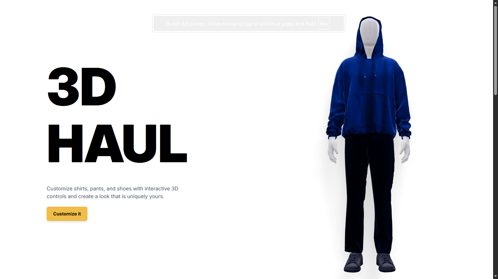
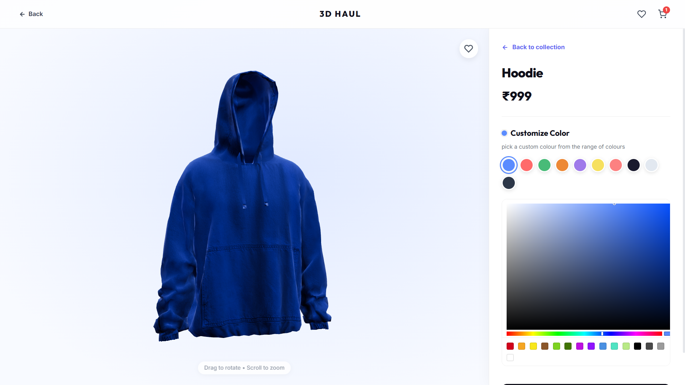

# 3D HAUL — Interactive 3D Fashion Customization Platform

3D HAUL is a modern 3D fashion customization platform that allows users to personalize clothing items in real-time using interactive 3D models. Built with React, Three.js, React Three Fiber, and Valtio, the application delivers an immersive shopping experience with live product previews and seamless customization.

## Previews

| Homepage / Intro View | Customizer / Shop View |
| :---: | :---: |
|  |  |

## Features

* Interactive 3D character visualization
* Real-time clothing color customization
* Independent customization of shirts, pants, and shoes
* E-commerce-inspired product browsing experience
* Responsive design for desktop and mobile devices
* Smooth animations and transitions
* Live 3D product previews
* Modern UI with glassmorphism-inspired design

## Tech Stack

### Frontend

* React
* Vite
* JavaScript

### 3D Graphics

* Three.js
* React Three Fiber
* Drei

### State Management

* Valtio

### Animation

* Framer Motion

### Styling

* Tailwind CSS

## Project Highlights

### Interactive 3D Experience

Users can rotate, inspect, and customize a 3D character model directly in the browser with real-time visual feedback.

### Product Customization

Customize clothing components independently:

* Shirts
* Pants
* Shoes

Changes are instantly reflected on the 3D model.

### E-Commerce Interface

Browse clothing items through product cards featuring:

* 3D previews
* Product information
* Color customization options
* Interactive user experience

## Getting Started

### Installation

```bash
npm install
```

### Run Development Server

```bash
npm run dev
```

Open:

```text
http://localhost:5173
```

### Build for Production

```bash
npm run build
```

## Future Enhancements

* Multiple clothing model variants
* Outfit saving and sharing
* Shopping cart integration
* User authentication


## License

This project is developed for educational, portfolio, and demonstration purposes.
