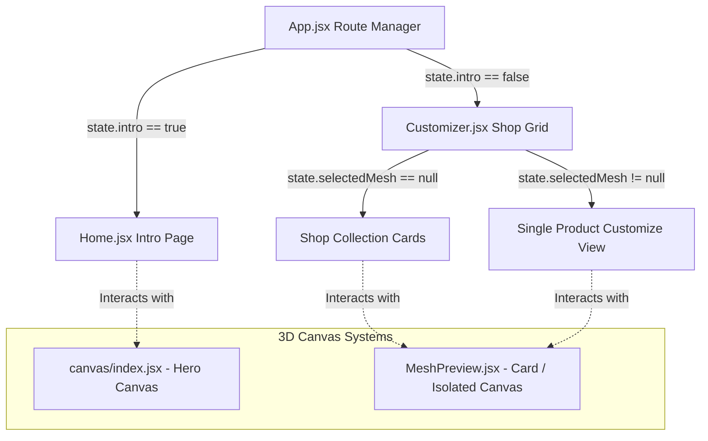

# 3D HAUL — Project Structure & Technical Architecture Documentation

This document provides a comprehensive technical breakdown of the **3D HAUL** codebase, explaining components, state flows, rendering techniques, and styling rules.

---

## 🗺 Application Architecture

The application is structured as a single-page application (SPA) with a custom URL hash-based router. It contains two main operational contexts:

1.  **Intro Mode (`intro: true`)**: A storytelling landing page where a large central 3D mannequin rotates in sync with scrolling and mouse pointer coordinates.
2.  **Customizer / Shop Mode (`intro: false`)**: An e-commerce grid showing individual product cards. Each card displays an isolated, auto-rotating 3D render of its mesh. Clicking *Customize* opens a split-screen workspace with a high-fidelity customizable canvas and color controls.



---

## 🗃 Global State Configuration (`src/store/index.js`)

State management utilizes **Valtio** for high-performance reactive updates without unnecessary component re-renders.

```javascript
import { proxy } from "valtio";

const state = proxy({
  intro: true,            // Toggle between Home (Intro) and Shop view
  homeScrollY: 0,         // Scroll tracker for mobile rotation dampening
  isDragging: false,      // Active dragging flag for OrbitControls
  hasInteracted: false,   // True if user clicked/dragged the 3D model
  
  shirtColor: '#5B8CFF',  // Color hex for Shirt mesh
  pantsColor: '#2E3D6B',  // Color hex for Pants mesh
  shoesColor: '#1A1A2E',  // Color hex for Shoes mesh
  selectedMesh: null,     // Id of item being customized ('shirt', 'pants', 'shoes')
  wishlist: [],           // Selected product ids in wishlist
  cart: [],               // Selected product ids in cart
  color: '#EFBD48',       // Legacy global color variable (if any)
});
```

---

## 🎨 Three.js & Fiber Pipelines (`src/canvas/`)

The 3D assets are loaded via GLTF and rendered using React Three Fiber.

### 1. The Global Scene Orchestrator ([src/canvas/index.jsx](file:///f:/ultimez/client/src/canvas/index.jsx))
*   Provides the primary `<Canvas>` for the landing page.
*   Binds `<OrbitControls>` to capture drag rotations. Updates `state.isDragging` and `state.hasInteracted` on drag start to override auto-rotation.
*   Wraps children with `<CameraRig>` and `<Backdrop>` for lighting, camera dampening, and shadow projection.

### 2. The Mannequin Model ([src/canvas/Model.jsx](file:///f:/ultimez/client/src/canvas/Model.jsx))
*   Loads `/Man.glb` containing geometries for `Body`, `Shoes_pair`, `Pants`, and `Shirt`.
*   **Critical Design Pattern: Material Cloning**
    In GLTF loaders, identical materials might share references across different meshes. To enable independent color configuration, the model clones its materials using React's `useMemo`:
    ```javascript
    const shirtMaterial = useMemo(() => materials['FABRIC_1_FRONT_1170.001'].clone(), [materials])
    const pantsMaterial = useMemo(() => materials['FABRIC_1_FRONT_1170.001'].clone(), [materials])
    const shoesMaterial = useMemo(() => materials['material_0'].clone(), [materials])
    ```
*   **Frame Dampening**:
    Colors are transitioned smoothly using `maath/easing`'s `dampC` function within `useFrame`:
    ```javascript
    useFrame((_state, delta) => {
      easing.dampC(shirtMaterial.color, snap.shirtColor, 0.25, delta)
      easing.dampC(pantsMaterial.color, snap.pantsColor, 0.25, delta)
      easing.dampC(shoesMaterial.color, snap.shoesColor, 0.25, delta)
    })
    ```

### 3. Isolated Sub-Mesh Previews ([src/canvas/MeshPreview.jsx](file:///f:/ultimez/client/src/canvas/MeshPreview.jsx))
*   Used to render just one item (e.g. only the Hoodie, Pants, or Shoes) inside a small canvas for individual product cards or customization panels.
*   Accepts a target `meshName` and `color`, extracts the matching geometry from `/Man.glb`, and applies cloned color configurations.
*   Applies a constant rotation velocity around the Y-axis within the frame loop:
    ```javascript
    useFrame((_, delta) => {
      if (groupRef.current) {
        groupRef.current.rotation.y += delta * 0.8
      }
    })
    ```

### 4. Camera Rigging & Dampening ([src/canvas/CamerRig.jsx](file:///f:/ultimez/client/src/canvas/CamerRig.jsx))
*   Manages camera repositioning between mobile and desktop break-points dynamically.
*   Applies camera location smoothing and smooth rotation offsets based on pointer positions:
    ```javascript
    const scrollRotation = snap.intro 
      ? (isBreakpoint ? snap.homeScrollY * 0.005 : window.scrollY * 0.005) 
      : 0;
    
    easing.dampE(
      group.current.rotation,
      [state.pointer.y / 10, -state.pointer.x / 5 + scrollRotation, 0],
      0.25,
      delta,
    )
    ```

---

## 📑 Page Implementations (`src/pages/`)

### 1. Landing Screen ([src/pages/Home.jsx](file:///f:/ultimez/client/src/pages/Home.jsx))
*   Consists of three modular scrolling sections (Hero, Live 3D Preview, Personalization).
*   Tracks scroll position on the `.home` element (via `onScroll`) and updates `state.homeScrollY` to control model rotation on mobile screens.
*   Animations are driven by `framer-motion` presets.

### 2. Shop Grid & Studio Customizer ([src/pages/Customizer.jsx](file:///f:/ultimez/client/src/pages/Customizer.jsx))
Defines the `PRODUCTS` data schema containing mesh parameters, pricing, and camera presets:
```javascript
const PRODUCTS = [
  { id: "shirt", meshName: "Shirt", colorKey: "shirtColor", name: "Hoodie", price: 999, ... },
  { id: "pants", meshName: "Pants", colorKey: "pantsColor", name: "Pants", price: 800, ... },
  { id: "shoes", meshName: "Shoes_pair", colorKey: "shoesColor", name: "Shoes", price: 500, ... }
]
```

*   **`ProductCard` Component**: Embeds a 3D R3F `<Canvas>` container to preview the isolated sub-mesh. Includes interactive wishlist, cart, and customize buttons.
*   **`CustomizerView` Component**: Replaces the list grid when a product is selected. It features a larger canvas with zoom/pan capabilities alongside a control panel with swatches, Sketch color picker, price tag, and cart triggers.

---

## 🔗 Hash Router Pipeline (`src/App.jsx`)

To ensure standard browser navigation operations (back, forward, bookmarking) work seamlessly on this single-page customized setup, `App.jsx` hosts two synchronizing `useEffect` blocks:

1.  **Hash to Valtio State**: Listens to `hashchange` events and updates state properties.
    *   `#/` or empty -> `intro = true`, reset customizations.
    *   `#shop` -> `intro = false`, `selectedMesh = null`.
    *   `#customize/:id` -> `intro = false`, `selectedMesh = :id`.
2.  **Valtio State to Hash**: Watches `snap.intro` and `snap.selectedMesh` changes and pushes corresponding hash overrides.

---

## 💅 Styling and Resiliency Configs

The styles are managed in [src/App.css](file:///f:/ultimez/client/src/App.css) using a combination of Tailwind v4 `@apply` and standard CSS modules.

Key systems include:
*   **`.ec-page`**: Positioned absolutely to overlay the primary 3D canvas and serve a fresh visual container for e-commerce activities.
*   **`data-lenis-prevent`**: Injected on scrollable panels (like the product grid and customizer drawer) to prevent Lenis from intercepting scroll events and locking the panel elements.
*   **Responsive Media Blocks**: Adjusts the homepage from a split-screen flex layout on desktop to a bottom-sheet interface overlaying a fixed 45vh canvas area on mobile.
